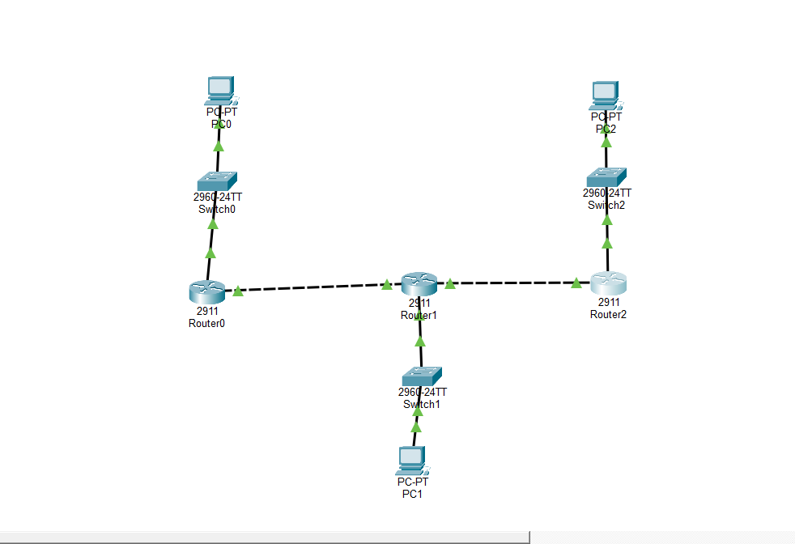
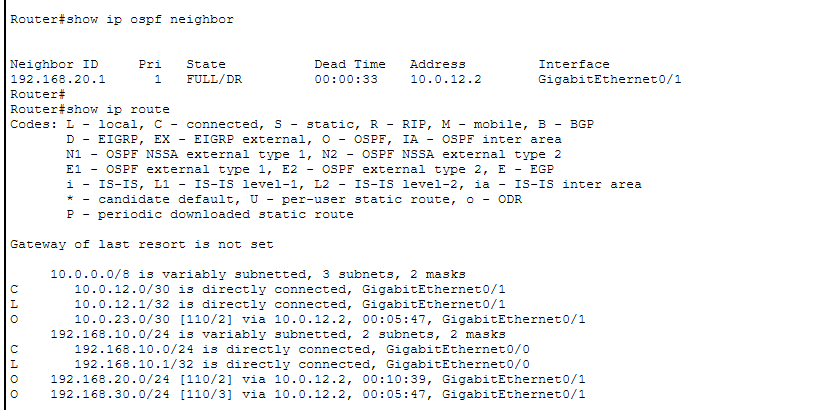
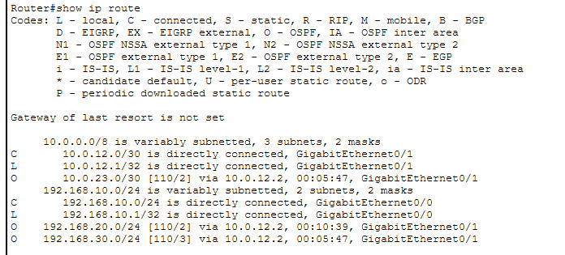
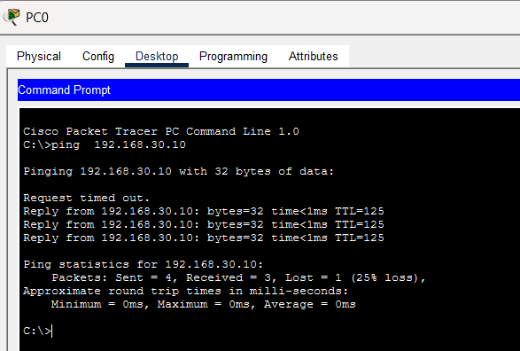
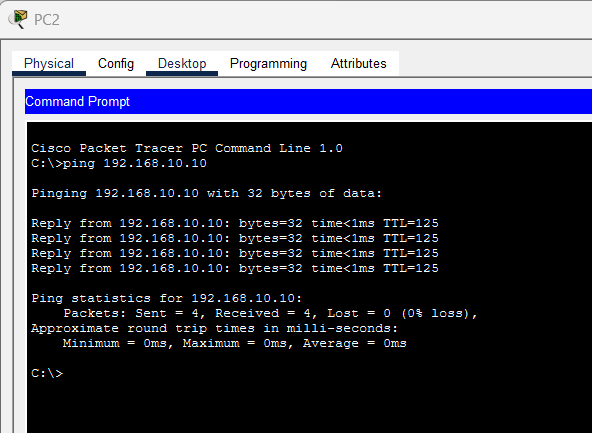

# Lab-4-OSPF-Dynamic-Routing
Cisco Packet Tracer lab demonstrating multi-router OSPF configuration, neighbor adjacency, dynamic route learning, and end-to-end connectivity across multiple networks.

## Objective

The objective of this lab was to configure OSPF dynamic routing across a three-router network and verify that routers could automatically learn routes to remote networks.

The lab demonstrates OSPF neighbor formation, route advertisement, routing-table verification, wildcard masks, and end-to-end connectivity across multiple networks.

---

## Network Topology



The topology consists of three routers, three switches, and three LANs connected through two point-to-point router links.

| Network | Purpose | Gateway / Router |
|---|---|---|
| 192.168.10.0/24 | LAN 1 | 192.168.10.1 |
| 192.168.20.0/24 | LAN 2 | 192.168.20.1 |
| 192.168.30.0/24 | LAN 3 | 192.168.30.1 |
| 10.0.12.0/30 | Router0 ↔ Router1 | Point-to-Point |
| 10.0.23.0/30 | Router1 ↔ Router2 | Point-to-Point |

---

## OSPF Configuration

OSPF was configured to dynamically advertise each router's directly connected networks through **Area 0**.

Example configuration:

```text
router ospf 1
network 192.168.10.0 0.0.0.255 area 0
network 10.0.12.0 0.0.0.3 area 0
```

Wildcard masks were used in the OSPF network statements:

```text
/24 → 0.0.0.255
/30 → 0.0.0.3
```

---

## OSPF Neighbor Verification

OSPF neighbor relationships were verified using:

```text
show ip ospf neighbor
```

A neighbor state of **FULL** confirmed that the routers successfully formed an OSPF adjacency and exchanged routing information.



---

## Dynamic Route Verification

The routing table was verified using:

```text
show ip route
```

Remote networks appeared with the route code:

```text
O = OSPF
```

For example, Router0 dynamically learned the remote VLAN 30 LAN:

```text
O 192.168.30.0/24 via 10.0.12.2
```



---

## Testing & Troubleshooting

Initial OSPF neighbor formation failed even though the routers could successfully ping each other.

Troubleshooting revealed that Router0's point-to-point interface was configured as:

```text
10.0.12.1/24
```

instead of the intended:

```text
10.0.12.1/30
```

After correcting the subnet mask to `255.255.255.252`, the OSPF neighbor relationship transitioned to **FULL**.

End-to-end testing then confirmed successful communication between:

```text
PC0 → Router0 → Router1 → Router2 → PC2
```

and in the reverse direction.




---

## Key Takeaways

- OSPF dynamically exchanges routing information between routers.
- OSPF neighbors must form an adjacency before exchanging routes.
- `FULL` indicates a completed OSPF adjacency.
- `O` identifies OSPF-learned routes in the routing table.
- OSPF network statements use wildcard masks.
- Area 0 is the OSPF backbone area.
- OSPF process IDs are locally significant and do not have to match between routers.
- Incorrect subnet masks can prevent OSPF neighbor formation.
- `show ip ospf neighbor`, `show ip route`, and `show ip protocols` are valuable OSPF troubleshooting commands.

---

## Skills Demonstrated

`OSPF` `Dynamic Routing` `IPv4 Subnetting` `Wildcard Masks` `Routing Tables` `OSPF Adjacency` `Cisco IOS` `Network Troubleshooting` `Packet Tracer`
